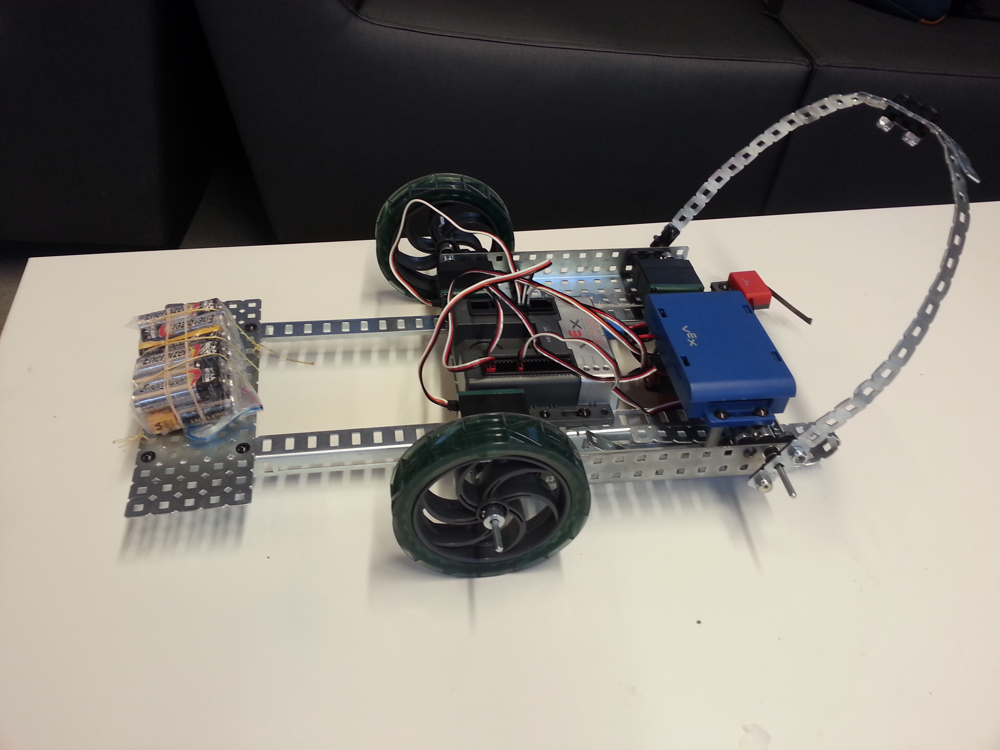

# Engineering Competitions
My friends and I competed in several engineering competitions in the senior design category. This involved building autonomous robots to deliver a task and present to industry judges! We had 8 hours to complete the challenge and had access to VEX mechanical and electrical components as well as Arduinos. 

**Team Members:**
* Candice Ip
* Doug Matthews
* Megan Nantel
* Adam Schonewille

---
# Table of Contents
1. [Third Competition: UBC Engineering Competition 2017](#third)
	1. [See it in Action](#third1)
	2. [The Challenge](#third2)
	3. [Results](#third3)
2. [Second Competition: Western Engineering Competition 2016](#second)
	1. [See it in Action](#second1)
	2. [The Challenge](#second2)
	3. [Results](#second3)
3. [First Competition: UBC Engineering Competition 2015](#first)
	1. [Image of the Robot](#first1)
	2. [The Challenge](#first2)
	3. [Results](#first3)

---

## Third Competition: UBC Senior Design 2017 
My friends and I competed in the 2017 Senior Design Competition as part of the UBC Engineering Competition. 

Check out the code: [FinalRobot.ino](UBC_EC-2017/Code/FinalRobot.ino)

### See it in action! 

 

Trouble viewing the GIF? Download the video here: [Video](UBC_EC-2017/IMG_1954.mp4)

### The Challenge 
The goal of this years competition was to design a porotype for a new version of the Canadarm. The robot had to be completely autonomous. The prototype was judged based on the following characteristics:
* **Strength** - How far can it push a mass (200 grams - 5 kg masses available).
* **Precision** - How accurately can it position a 200 gram mass (both vertically and horizontally).
* **Speed** - How fast can it position the 200 gram mass.

### Results 
Our team placed 2nd out of 7 teams! The judges were impressed by the mechanical design of our arm. It was very robust and we were happy with the functionality. Unfortunately, the mechanical design took longer than expected and we were unable to tune our arm to the challenge. Had we had a little longer we think we would have perform much better in the final challenge.

---

## Second Competition: Western Engineering Competition 2016 
My friends and I competed in the 2016 Western Engineering Senior Design Competition in Kelowna, BC as representatives from UBC!

Check out the code: [WEC_Final_Code.c](WEC-2016/Code/WEC_Final_Code.c)

### See it in action! 

 

Trouble viewing the GIF? Download the video here: [Video](WEC-2016/pid.mp4)

### The Challenge 
The goal of this years competition was to "Breaking Boundaries" and design a robot to save casualities in an arena. The robot had to be completely autonomous. The prototype was judged based on the following characteristics:
* **Navigation** - Find objects (casualties) marked by black tape and traverse hills and in an arena.
* **Precision** - How accurately it can position an object in certain location.
* **Speed** - How fast it can obtain objects within 120 seconds.

### Results 
Our team was commended for its design and ingenuity in delivering its tasks! The judges were impressed by the comprehensive detail in our design to complete the tasks. Unfortunately, the tasks were not fully integrated to perform a completed full run during the competition. Had we had more availablility to components, we believe we would have had smoother integration between tasks and a lighter robot. Overall, we were proud of our design and we were able to impress the judges. 

---

## First Compeition: UBC Engineering Competition 2015 
Our first competition was at UBC in 2015 as a team in the Senior Design category. 

Check out the code: [UBCEC_Code.c](UBC_EC-2015/Code/UBCEC_Code.c)

### Picture of our robot! 

 

### The Challenge 
The goal of this years competition was about transportation and to build a robot to move freight to its final location. The prototype was judged based on the following characteristics:
* **Autonomy** - Being able to traverse the competition autnomously.
* **Precision** - How accurately it can position an object in certain location.
* **Strength** - How many items the robot could bring to its final destination.

### Results 
We ended up at 1st out of eight teams in the competition. Our robot was able to deliver an object to its final path, being only two of the eight teams to successfully acheive this task! Our design was lightweight and effecient in manuevering the track with PID control. From this competition, we were invited to participate in the Western Engineering Competition. 
